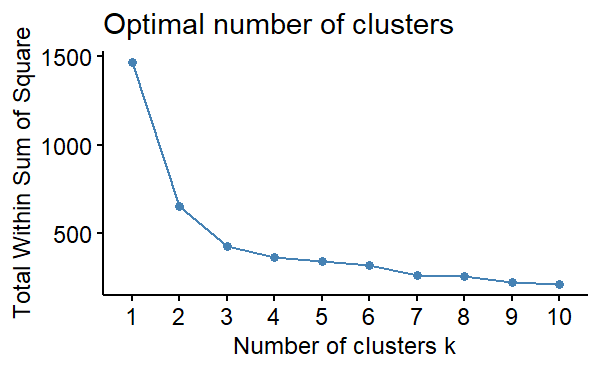
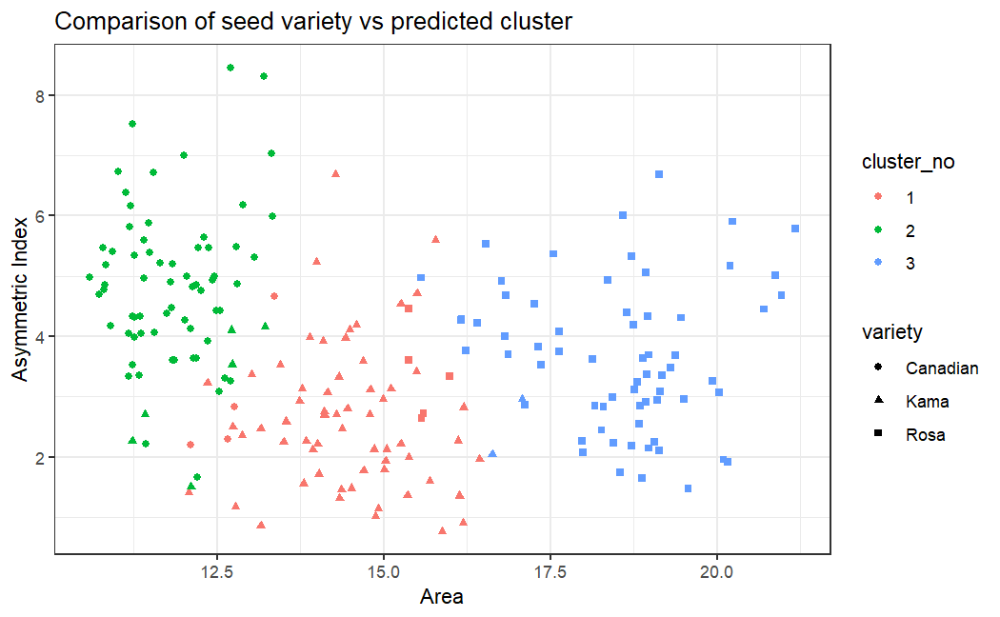
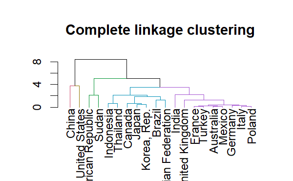

# Lab 5: Clustering Analysis on GHG Emissions

This lab was a learning module as part of the ESM 244 course in Advanced Data Analysis Methods.

**What I learned, and the type of analysis I can quickly support:**
- **Language**: R
- **Data Analysis Methods:** Clustering ([NbClust](https://cran.r-project.org/web/packages/NbClust/index.html))
- **Other Activities:** Creating Dendrograms ([dendextend](https://cran.r-project.org/web/packages/dendextend/index.html) & [ggdendro](https://cran.r-project.org/web/packages/ggdendro/index.html)), Various Clustering Methods ([factoextra](https://cran.r-project.org/web/packages/factoextra/index.html) & [cluster](https://cran.r-project.org/web/packages/cluster/index.html)).

### Optimal number of clusters to summarize 3 distinct plant varieties based on seed values

### Comparing expected cluster with seed variety

### Dendrogram depicting a complete linkage method of clustering for per-country GHG emissions

